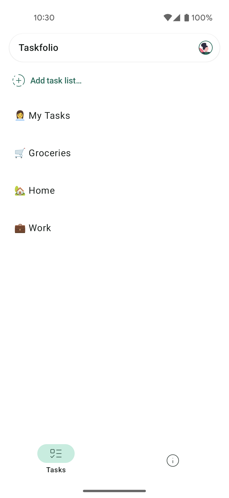
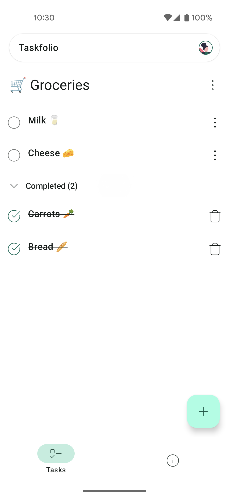
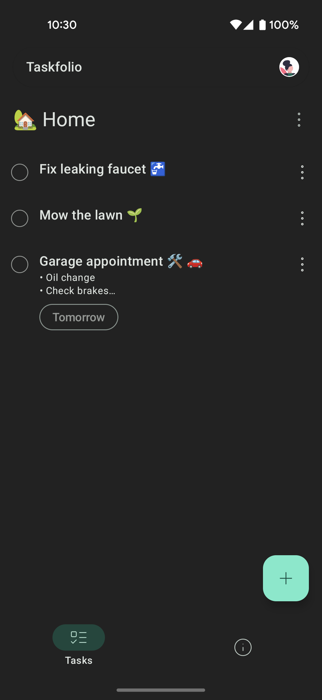

[](https://github.com/opatry/tasks-app/actions/workflows/build.yml)

# Taskfolio

[**Taskfolio**](https://opatry.github.io/taskfolio) is an Android task management app built using [Google Tasks API](https://developers.google.com/tasks/reference/rest). Developed to demonstrate my expertise in modern Android development, it highlights my skills in architecture, UI design with Jetpack Compose, OAuth authentication, and more—all packaged in a sleek, user-friendly interface.

> I set out to revisit the classical TODO app, ‘local-first’ syncing with Google Tasks—aiming for an <abbr title="Minimum Viable Experience">MVE</abbr> in 2 weeks, focusing on the 80/20 rule to nail the essentials.

|  |  |   |
| --------------------------------------- |--------------------------------------- | ---------------------------------- |

[](https://play.google.com/store/apps/details?id=net.opatry.tasks.app)

## Tech stack

- [Kotlin](https://kotlinlang.org/), [Multiplatform (KMP)](https://kotlinlang.org/docs/multiplatform.html) (currently Desktop & Android are supported)
- [Kotlin coroutines](https://kotlinlang.org/docs/reference/coroutines/coroutines-guide.html)
- [Kotlin multiplatform](https://kotlinlang.org/docs/multiplatform.html) (aka KMP)
- [Ktor client](https://ktor.io/) (+ [Kotlinx serialization](https://kotlinlang.org/docs/serialization.html))
- [Room](https://developer.android.com/training/data-storage/room)
- [Koin](https://insert-koin.io/) for dependency injection
- [Material Design Components](https://developer.android.com/develop/ui/compose/designsystems/material3)
- [Jetpack Compose](https://developer.android.com/jetpack/compose)
- [Coil](https://coil-kt.github.io/coil/)

## Project breakdown

- `:google`
  - [`:oauth`](google/oauth/) <span style="color: #00FF00;">■■■■■■■■■■</span> 100%
    - [Google OAuth2](https://developers.google.com/identity/protocols/oauth2) authentication with Kotlin & Ktor
    - KMP
  - [`:tasks`](google/tasks) <span style="color: #00FF00;">■■■■■■■■■■</span> 100%
    - [Google Tasks REST API](https://developers.google.com/tasks/reference/rest) bindings for Kotlin using Ktor HTTP client 
    - KMP
- [`:lucide-icons`](lucide-icons) <span style="color: #00FF00;">■■■■■■■■■■</span> 100%
  - [Lucide Icons](https://lucide.dev/icons/) for Compose
  - Made from [Compose Icons](https://composeicons.com/icon-libraries/lucide) (not using the direct Gradle dependency to tweak stroke width)
  - Only integrates what seem relevant for the app needs
  - KMP
- [`:tasks-core`](tasks-core) <span style="color: #CCFF00;">■■■■■■</span>□□□□ 60%	
  - Taskfolio business logic
  - Local first with Room database, sync with Google Tasks 
  - KMP
- [`:tasks-app-shared`](tasks-app-shared) <span style="color: #99FF00;">■■■■■■■</span>□□□ 70%	
  - All screens & UI components integrating the `:tasks-core` business logic
    in Compose
  - KMP
- [`:tasks-app-desktop`](tasks-app-desktop) <span style="color: #33FF00;">■■■■■■■■■</span>□ 90%
  - The Desktop application (thin layer fully reusing `:tasks-app-shared`)
- [`:tasks-app-android`](tasks-app-android) <span style="color: #66FF00;">■■■■■■■■</span>□□ 80%
  - The Android application (thin layer fully reusing `:tasks-app-shared`)
- [`website/`](website) <span style="color: #FF6600;">■■</span>□□□□□□□□ 20%
  - The [static site](https://opatry.github.io/taskfolio/) presenting the project
  - Made with [Jekyll](https://jekyllrb.com/) and served by [Github pages](https://pages.github.com/)

## Local development

<details>
<summary>See details…</summary>
Decrypt `*.gpg` files needed for development, and copy decrypted versions in proper places.

```bash
PLAYSTORE_SECRET_PASSPHRASE=MY_SECRET ./_ci/decrypt_secrets.sh
```

### Updating `google-services.json`

The production `google-services.json` file is ignored by SCM to avoid exposing API keys in public repository.
To update it, download the new version, encrypt it using `gpg --symmetric --cipher-algo AES256 google-services.json` 
and store this in `_ci/google-services.json.gpg`.
The `decrypt_secrets.sh` will take it into account.
</details>

## License

```
The MIT License (MIT)

Copyright (c) 2024 Olivier Patry

Permission is hereby granted, free of charge, to any person obtaining a copy
of this software and associated documentation files (the "Software"), to deal
in the Software without restriction, including without limitation the rights
to use, copy, modify, merge, publish, distribute, sublicense, and/or sell
copies of the Software, and to permit persons to whom the Software is
furnished to do so, subject to the following conditions:

The above copyright notice and this permission notice shall be included in all
copies or substantial portions of the Software.

THE SOFTWARE IS PROVIDED "AS IS", WITHOUT WARRANTY OF ANY KIND, EXPRESS OR
IMPLIED, INCLUDING BUT NOT LIMITED TO THE WARRANTIES OF MERCHANTABILITY,
FITNESS FOR A PARTICULAR PURPOSE AND NONINFRINGEMENT. IN NO EVENT SHALL THE
AUTHORS OR COPYRIGHT HOLDERS BE LIABLE FOR ANY CLAIM, DAMAGES OR OTHER
LIABILITY, WHETHER IN AN ACTION OF CONTRACT, TORT OR OTHERWISE, ARISING FROM,
OUT OF OR IN CONNECTION WITH THE SOFTWARE OR THE USE OR OTHER DEALINGS IN THE
SOFTWARE.
```
